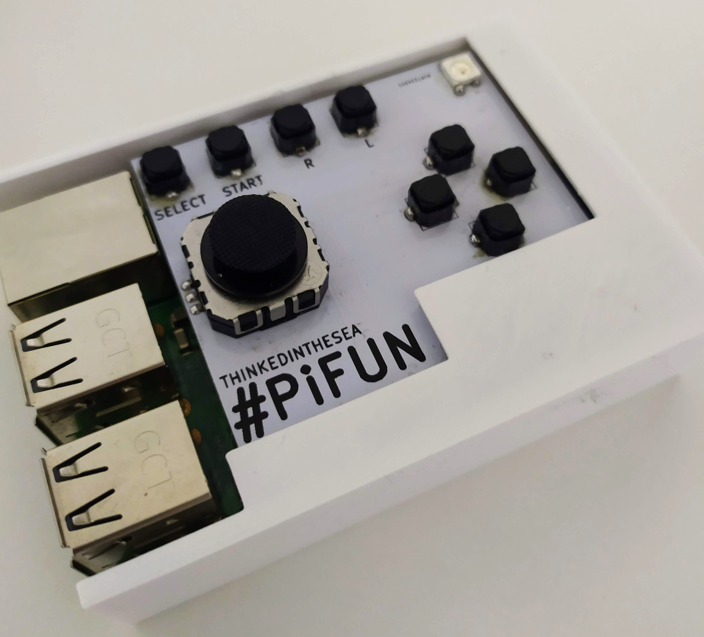

# PiFUN

Addon board for Raspberry Pi. It provides a simple way to start using your Raspberry Pi as a complete and portable Retrogaming machine.  

  
  
  
PiFUN.ino   -   Arduino source code for attiny84   
final.stl   -   3D Case   
install.sh  -   Install script   
led.py      -   Python script for WS2812B led   
pyfun.cfg   -   Button config   

how to install:

cd /home/pi\
curl https://raw.githubusercontent.com/thinkedinthesea/PiFUN/master/install.sh > install.sh\
sudo bash install.sh
